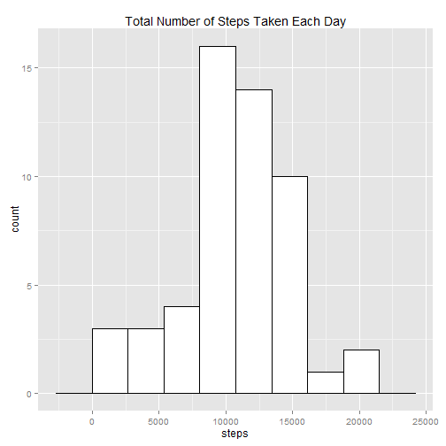
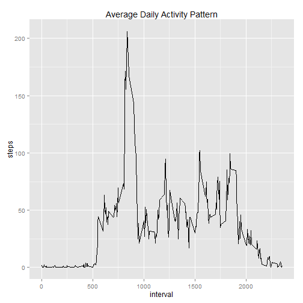
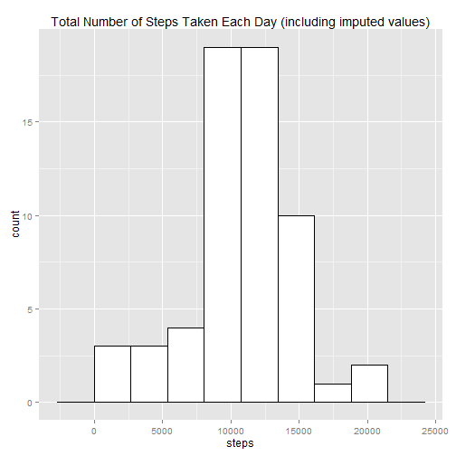
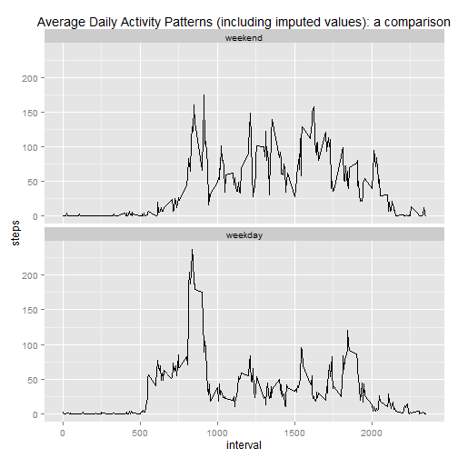

# Reproducible Research: Peer Assessment 1   

A report based on the personal movement dataset described in the README.md associated with this repository.


## Loading and preprocessing the data

### Part 1   

The R environment is prepared for the analysis: required packages (ggplot2 and reshape2) are loaded and options are set for how to display numeric values.


```r
# Load packages required
library("ggplot2")
library("reshape2")

# Turn off scientific notation
options(scipen = 999)
```


The data has already been downloaded and saved to the home directory, and can now be unzipped and read in. 


```r
# Read in the activity data
unzip("./activity.zip")
df <- read.csv("./activity.csv")
```


### Part 2   

A little processing is done to make the data more manageable later on.


```r
# Change class of 'date' variable to Date
df$date <- as.Date(df$date, "%Y-%m-%d")
```


## What is mean total number of steps taken per day?

### Part 1  

The data is summarized in terms of total number of steps per day.


```r
# Aggregating the total of all steps by day
stepsByDate <- tapply(df$steps, df$date, FUN = sum)
stepsByDate <- melt(stepsByDate, varnames = "date", value.name = "steps")
```

### Part 2   

A histogram of the total number of steps per day can be made from that summary.


```r
# Calculate a reasonable binwidth (based on the Rice Rule)
bw <-  diff(range(stepsByDate$steps, na.rm = TRUE)) / 
  (2 * (length(stepsByDate$steps) ^ (1 / 3)))

# Plot 1
p1 <- ggplot(stepsByDate, aes(x = steps)) +
  geom_histogram(colour = "black", fill = "white", binwidth = bw) + 
  labs(title = "Total Number of Steps Taken Each Day")
p1
```

 


### Part 3  

The mean and median of the total number of steps taken each day can be calculated.


```r
# Calculate mean and median (no more than two decimal places, if rounded)
mean1 <- round(mean(stepsByDate$steps, na.rm = TRUE), 2)
median1 <- median(stepsByDate$steps, na.rm = TRUE)
```


The mean total number of steps per day is 10766.19.  
The median total number of steps per day is 10765.


## What is the average daily activity pattern?

### Part 1   

The average daily activity pattern is determined by summarizing the data in terms of the average number of steps per interval.


```r
# Aggregating the mean of steps per interval
avgStepsByInt <- tapply(df$steps, df$interval, mean, na.rm = TRUE)
avgStepsByInt <- melt(avgStepsByInt, varnames = "interval", 
                                    value.name = "steps")
```


The results are then displayed as a time series plot of the average number of steps taken (averaged across all days) versus the 5-minute intervals.


```r
# Plot 2
p2 <- ggplot(avgStepsByInt, aes(x = interval, y = steps)) + 
  geom_line() + 
  labs(title = "Average Daily Activity Pattern")
p2
```

 


### Part 2 

Which 5-minute interval, on average across all the days in the dataset, contains the maximum number of steps can now be determined.


```r
#Determine interval with max average steps per day
maxAvgStepsInterval <- which.max(avgStepsByInt$steps)
maxInterval <- avgStepsByInt[maxAvgStepsInterval,]
maxInterval
```

```
##     interval    steps
## 104      835 206.1698
```

The 5-minute interval that, on average, contains the maximum number of steps is interval 835.


## Imputing missing values

### Part 1  

Now we consider the impact of missing values in the original dataset. The number of missing values (rows with NAs) is now calculated.


```r
# Count missing values
numNA <- sum(is.na(df$steps))
numNA
```

```
## [1] 2304
```

The number of missing values in the original dataset is 2304.

An exploration of the original dataset to better understand the distribution of missing values shows that all NAs correspond to just eight dates. These represent eight whole days with missing values (one day = 288 observations).


```r
# Dates with missing values in the original dataset
stepsByDate_missing <- stepsByDate[is.na(stepsByDate$steps),]
stepsByDate_missing
```

```
##          date steps
## 1  2012-10-01    NA
## 8  2012-10-08    NA
## 32 2012-11-01    NA
## 35 2012-11-04    NA
## 40 2012-11-09    NA
## 41 2012-11-10    NA
## 45 2012-11-14    NA
## 61 2012-11-30    NA
```

```r
# Distribution of missing values in original dataset by weekday
day <- weekdays(df$date)
day <- factor(day, 
              levels = c("Monday", "Tuesday", "Wednesday", "Thursday", "Friday", "Saturday", "Sunday"))
df_missingByDay <- tapply(df$steps, day, f <- function(x){sum(is.na(x))})
df_missingByDay
```

```
##    Monday   Tuesday Wednesday  Thursday    Friday  Saturday    Sunday 
##       576         0       288       288       576       288       288
```


### Part 2  

One relatively simple and blunt strategy for imputing missing values would to use the mean number of steps of each interval of each weekday. This summary can then be merged with the original dataset to create a new dataset. Only the observations with NA values will be modified to have imputed values. The code for this strategy is shown in the next part of this section.


### Part 3

The new dataset is created based on the above strategy, containing all of the original values plus the imputed ones, in one long form dataframe. Below is the code for applying the imputation strategy.


```r
# Create new dataset containing original and imputed values
df$day <- weekdays(df$date)
df$day <- factor(day, 
                 levels = c("Monday", "Tuesday", "Wednesday", "Thursday", "Friday", "Saturday", "Sunday"))
avgStepsByDayInt <- tapply(df$steps, list(df$day, df$interval), mean, na.rm = TRUE)
avgStepsByDayInt <- melt(avgStepsByDayInt, varnames = c("day", "interval"), 
                         value.name = "meanSteps")
imputeDf <- merge(df, avgStepsByDayInt, by = c("day", "interval"))
imputeDf$steps <- ifelse(is.na(imputeDf$steps), imputeDf$meanSteps, imputeDf$steps)
```


### Part 4   

A histogram of total steps per day can be produced for the new, imputed values dataset, along with new calculations of mean and median averages for total steps per day.


```r
# Aggregate total steps by date
imputeStepsByDate <- tapply(imputeDf$steps, imputeDf$date, FUN = sum)
imputeStepsByDate <- melt(imputeStepsByDate, varnames = "date", value.name = "steps")
```


```r
# Plot 3 (using same binwidth as plot 1)
p3 <- ggplot(imputeStepsByDate, aes(x = steps)) + 
  geom_histogram(colour = "black", fill = "white", binwidth = bw) + 
  labs(title = "Total Number of Steps Taken Each Day (including imputed values)")
p3
```

 


```r
# Calculate mean and median (no more than two decimal places, if rounded)
mean2 <- round(mean(imputeStepsByDate$steps, na.rm = TRUE), 2)
median2 <- median(imputeStepsByDate$steps, na.rm = TRUE)
```

The mean total number of steps per day (including imputed values) is 10821.21.   
The median total number of steps per day (including imputed values) is 11015.   

The use of imputed values has a noticeable impact the averages calculated, increasing both mean and median compared to earlier calculations. The median is now greater than the mean and the difference between the two averages has increased as well.


## Are there differences in activity patterns between weekdays and weekends?

### Part 1  

The imputed values dataset is modified to include a variable for the kind of day (weekend or weekday) on which the observations fall.


```r
# Use 'day' values to determine the part of the week 
imputeDf$dayType <- ifelse(imputeDf$day == "Saturday" | imputeDf$day == "Sunday", "weekend", "weekday")
imputeDf$dayType <- factor(imputeDf$dayType, levels = c("weekend", "weekday"))
```


### Part 2   

Possible differences in the average daily activity patterns between weekday and weekend periods can now be considered. A panel plot is created comparing the average number of steps taken per 5-minute interval across weekdays and weekends. 


```r
# Aggregate data into steps per interval and part of the week
imputeAvgStepsByInt <- tapply(imputeDf$steps, 
                               list(imputeDf$dayType, imputeDf$interval), mean)
imputeAvgStepsByInt <- melt(imputeAvgStepsByInt, 
                             varnames = c("dayType", "interval"), value.name = "steps")
```


```r
# Plot 4
p4 <- ggplot(imputeAvgStepsByInt, aes(x = interval, y = steps)) + 
  geom_line() + 
  facet_wrap(~dayType, nrow = 2) + 
  labs(title = "Average Daily Activity Patterns (including imputed values): a comparison")
p4
```

 


There are some noticeable differences between weekend and weekday activity patterns.
